# 📘 React Native Storybook Isolation PoC

**Status:** Proof of Concept

This repository demonstrates a clean architectural pattern for developing, documenting, and testing a **React Native Component Library** using **Expo** and **Storybook**, while maintaining strict dependency isolation.

## 🎯 Goal

To use the developer experience of **Expo** (for running Storybook, and testing) **without** adding Expo as a dependency to the component library itself.

This ensures that consumers of the Component Library (e.g., other apps in our organization) do not inherit heavy Expo dependencies or configuration files.

## 🏗 Architecture

```mermaid
graph TD
    subgraph "Monorepo"
        LIB[📦 packages/ui-library]
        APP[📱 apps/storybook-app]
    end

    subgraph "External World"
        CONSUMER[🚀 Real Consumer App]
    end

    %% Relationships
    APP -- imports --> LIB
    CONSUMER -- imports --> LIB
    
    %% Dependencies
    LIB -- depends on --> RN[react / react-native]
    APP -- depends on --> EXPO[Expo SDK]
    APP -- depends on --> SB[Storybook]

    %% Isolation
    style LIB fill:#e1f5fe,stroke:#01579b
    style APP fill:#e8f5e9,stroke:#2e7d32
    style EXPO fill:#fff3e0,stroke:#ff6f00,stroke-dasharray: 5 5

```



### Key Benefits

1. **Zero Expo Pollution:** The `component-library` remains pure React Native. It contains no `expo` packages, `app.json`, or native Expo modules.
2. **Visual Testing Playground:** The `storybook-app` acts as a dedicated harness. We use Expo's `prebuild` capabilities to generate native binaries for robust visual and manual testing on emulators.
3. **Fast Iteration:** Developers can write components in the library and immediately verify them in the Storybook app using Expo Go or a Development Build.

## 📂 Project Structure

**`packages/component-library`**: The pure component library.
* Dependencies: `react`, `react-native` only.
* Output: Pure JS/TS components.


**`apps/storybook-app`**: The test harness.
* Dependencies: `expo`, `react-native`, `@storybook/react-native`, and the local `component-library`.
* Purpose: Renders the stories defined in the library components.


## 🚀 Getting Started

### Prerequisites

* Node.js & Yarn/NPM
* Android Studio (for Android Emulator) or Xcode (for iOS Simulator)
* React Native development environment set up

### Installation

Install dependencies from the monorepo root:

```bash
yarn install
```

### Running the Storybook App

To verify components manually, run the Storybook app via Expo:

```bash
# Inside apps/storybook-app
yarn start --clear --tunnel
```

*Press `a` to open in Android Emulator, or `i` for iOS Simulator.*

## ✅ verifying the Proof of Concept

### 1. Verification of Isolation

Check the `package.json` of the library:

```bash
cat packages/ui-library/package.json
```

**Success Criteria:** You will see **no** reference to `expo`, `expo-status-bar`, or `@expo/vector-icons` in the `dependencies` or `peerDependencies`.

### 2. Verification of Native Build (Prebuild)

To confirm that the Storybook app can generate a real native binary (essential for visual regression testing tools like Appium/WebdriverIO) without breaking:

```bash
cd apps/storybook-app
npx expo prebuild --clean
```

**Success Criteria:** The command finishes successfully, generating `android` and `ios` folders. This proves the Expo environment is correctly wrapping the pure UI library.

### 3. Verification of App Compilation

To confirm the app actually runs on a device (ensuring no native linking errors occur):

```bash
# Inside apps/storybook-app
npx expo run:android
# or
npx expo run:ios
```

**Success Criteria:** The app installs on the emulator and opens the Storybook UI, allowing you to click through component stories.

---

## 🛠 Future Steps (Visual Testing)

Since this architecture produces a valid native binary (`.apk` / `.app`), it is fully compatible with automation tools.

* **Tooling:** WebdriverIO + Appium.
* **Strategy:** Build the app using `gradlew`, then point Appium to the binary to automate screenshot capture of every story.